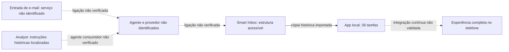

# Auditoria da automação existente

[[Projetos/App Mamãe/00 - App Mamãe|← Projeto]]

> **Atualização posterior no mesmo dia:** o robô e seu prompt foram encontrados no repositório Tend. Ver [[Projetos/App Mamãe/09 - Robô Tend localizado]]. As conclusões abaixo registram o estágio inicial da busca; a implementação Anthropic/Netlify e os papéis distintos das bases já foram identificados no código.

Verificação em **19/09/2026, aproximadamente 21h50 (America/Sao_Paulo)**. Consultas somente leitura ao código, banco local, referências históricas e Notion. Este registro não representa ativação ou alteração de uma automação.

**Resultado:** a implementação local responde, a base Smart Inbox está acessível e foram localizadas instruções antigas de comportamento no Notion. O agente que processava os e-mails, seu provedor e o gatilho de entrada continuam sem identificação comprovada.

## Evidências verificadas nesta auditoria

| Item | Evidência | Limite da conclusão |
| --- | --- | --- |
| Servidor local | `GET http://127.0.0.1:4310/api/health` retornou `ok: true`, app `App Mamãe` | Prova que o servidor respondeu naquele momento; não valida o fluxo externo nem a interface |
| Banco local | 36 tarefas, 37 eventos, 1 operação na fila de saída, 0 documentos e 0 áudios | Contagem em SQLite aberto em modo somente leitura; nenhuma operação da fila foi enviada |
| Configuração persistida | Apenas `notionDataSourceId` está presente na tabela de configurações; não existe `app/.env` | Não foram inspecionadas variáveis do processo em execução; isso não prova ausência de configuração em outro serviço |
| IA do app local | `server/integrations.mjs` monta instruções locais e faz chamadas à API Responses da OpenAI | O adaptador não identifica nem recupera o agente antigo ou seus refinamentos |
| Google | O status de Google no adaptador local é fixado como não configurado | Não há conexão direta com Gmail/Drive implementada nesse adaptador |
| Smart Inbox remoto | Leitura bem-sucedida da base `b5b9176a-dd65-44e8-922f-494bb218a88c` e de sua estrutura | A leitura da base não comprova captura automática de novos e-mails |
| Instruções antigas | Página `Analyst` acessível, com regras de triagem e revisão para Carla/CG Design | A página existe; não foi comprovado qual agente a usa, nem se as regras ainda estão ativas |

## Base identificada e contrato existente

[📬 Smart Inbox (teste do robô)](https://app.notion.com/p/b5b9176add6544e8922f494bb218a88c)

- Database: `b5b9176a-dd65-44e8-922f-494bb218a88c`.
- Data source: `d8a913b6-15ad-4c9c-beff-27e4c5188336`.
- Campos observados incluem `Message id`, `Thread id`, `Gmail link`, `Action required`, `Summary`, `Next action`, `Response / action for approval`, `Carla review`, `Carla feedback` e `Completed`.
- As opções atuais de `Source` incluem `LOLI` e `tend`. São rótulos do banco; não identificam por si sós um provedor ou serviço executor.
- O CSV histórico preservado no cofre contém 320 registros: 295 com `Source=tend`, 25 sem origem preenchida e nenhum com `Source=LOLI`. Essa contagem é do arquivo local histórico, não uma contagem atual da base remota.
- A busca remota também encontrou uma base chamada `📬 Smart Inbox (teste do robô) (1)`. Ela não foi adotada como origem do app. Não escolher uma base apenas por nome ou data de edição.

Nenhuma propriedade, opção, visualização ou página remota foi alterada.

## Instruções antigas recuperadas como referência

[Analyst](https://app.notion.com/p/39d2004f288080b4a1c2d013af63ada3), com última edição informada pelo Notion em **03/09/2026**.

A página registra orientações específicas do produto:

- Preparar a resposta ou ação completa para Carla/CG Design e submetê-la à revisão.
- Manter envio e execução externa sob controle humano.
- Revisar o resultado após feedback e devolvê-lo para avaliação.
- Separar tarefas pessoais da caixa da Carla.
- Derivar categoria, prioridade, próximo passo, responsável, prazo e resumo do conteúdo real da mensagem.
- Distinguir notificações rotineiras de alertas críticos e preservar a estrutura existente da base.

**Uso correto desta descoberta:** fonte histórica a comparar com as correções de 19/09 e com exemplos reais. As instruções da página não foram adotadas automaticamente, copiadas para o app ou tratadas como autorização para executar ações. Regras antigas de encaminhamento, idioma e criação de opções precisam ser reconciliadas com o escopo atual.

A página [CG Design](https://app.notion.com/p/3ce2004f2880802d9341fd6d44817d9f) ainda descreve revisão de Carla e execução manual após aprovação. A base embutida nessa página foi consultada e se chama **🎥 Resumos de reuniões — Zoom**; não é a base Smart Inbox identificada acima.

## Divergências e limites de acesso

1. O prompt antigo aponta o database `3ce2004f28808045a662d5b0314775dc`. A consulta atual retornou “não encontrado ou sem acesso”. Não há base para afirmar que foi apagado nem para equipará-lo ao Smart Inbox acessível.
2. As buscas de agentes do Notion pelos nomes `LOLI` e `Smart Inbox` retornaram **403 / restricted_resource**, com mensagem de restrição de cobrança do workspace. Esse bloqueio impediu a inspeção dos agentes por essa ferramenta. Não comprova que o fluxo antigo dependia de um agente do Notion ou que parou de funcionar.
3. O relato da usuária continua apontando OpenAI ou Anthropic, com lembrança mais forte de OpenAI. Nenhum ID de agente/projeto, prompt versionado ou registro de execução desses provedores foi encontrado nos arquivos inspecionados.
4. Não foi localizado um workflow n8n implantado, endpoint do gatilho ou ligação comprovada entre e-mail, processamento e registro no Notion. Os JSONs `sources/smart-inbox.json` e `sources/smart-inbox-enrichment.json` são dados/referências, não exports de workflows n8n.
5. O espelho do projeto avisa que uma fonte não pôde ser sincronizada. A ausência de um artefato nesse espelho não comprova que ele não existe.

## Mapa do que foi comprovado

## Próximo passo concreto

Obter o **nome ou link do agente/projeto original ou da ferramenta que recebe os e-mails**. Com essa referência, verificar as instruções e um registro de execução, correlacionando `Message id` / `Thread id` com a página resultante no Smart Inbox. Não é necessário enviar chaves ou senhas no chat.

Caso o serviço original seja um agente do Notion, a inspeção pelas ferramentas de agentes depende da resolução da restrição informada pelo workspace ou de uma referência/configuração acessível por outro meio autorizado. Não há evidência para recomendar pagamento ou mudança de plano como solução do projeto inteiro.

Depois de localizar o processador, comparar suas instruções com `Analyst` e com as correções atuais, antes de substituir serviços ou conectar o app à produção. Plataforma do telefone, orçamento e autonomia de ações continuam pendentes em [[Projetos/App Mamãe/03 - Decisões e questões em aberto]].

## Fontes locais consultadas

- [[Projetos/App Mamãe/04 - O que existe hoje]] e [[Projetos/App Mamãe/05 - Próximos passos]].
- [[Projetos/App Mamãe/Referências/Análise histórica - Smart Inbox e Formulary]].
- [[Projetos/App Mamãe/Anexos/Transcrição com timestamps - 2026-09-19.txt]].
- [[Projetos/App Mamãe/Referências/Prompt — Smart Inbox App 9eafcf88d04745b28ed318a95ad08edd|Prompt — Smart Inbox App]].
- CSV histórico `📬 Smart Inbox (teste do robô) b5b9176add6544e8922f494bb218a88c_all.csv`, na raiz do cofre.
- Implementação em `/Users/MAC/.codex/.chatgpt-projects/g-p-6a9df5eae2ec8191aa5761aa680a7482/app`: `server/integrations.mjs`, `server/index.mjs`, `server/store.mjs`, `scripts/import-notion-copy.mjs`, documentação e contagens do banco.

Esta auditoria não executou testes de software, chamadas de geração/transcrição, sincronização, envio de e-mail, migração ou alterações na implementação.
